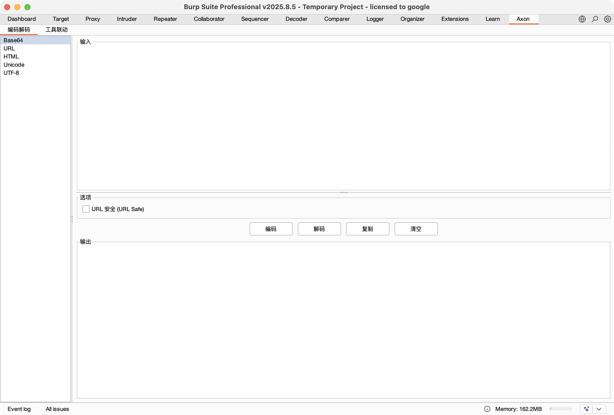
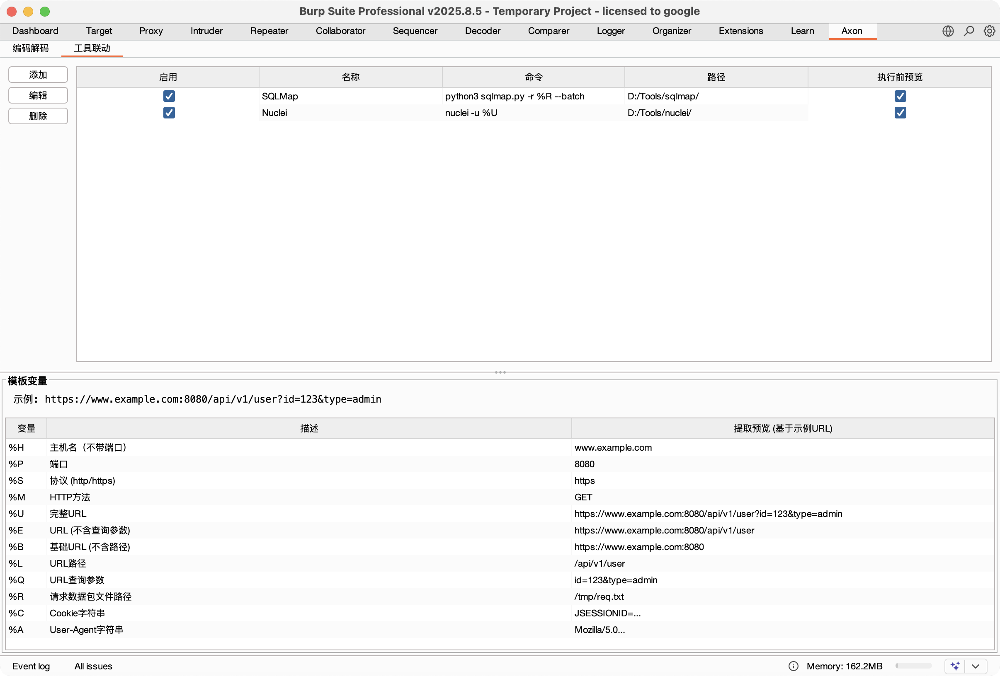
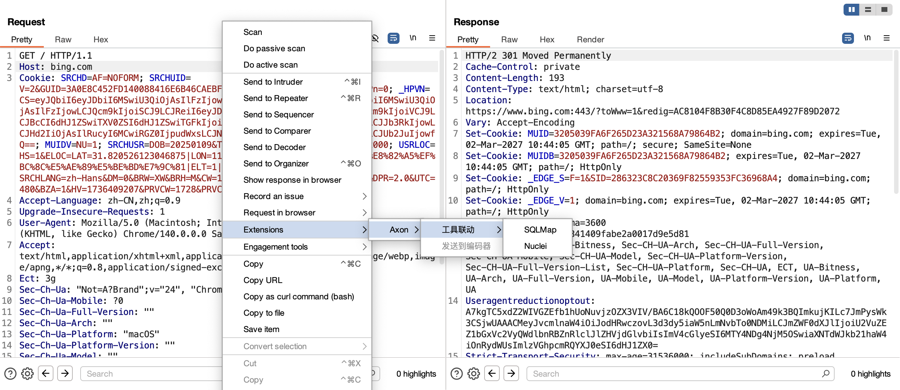
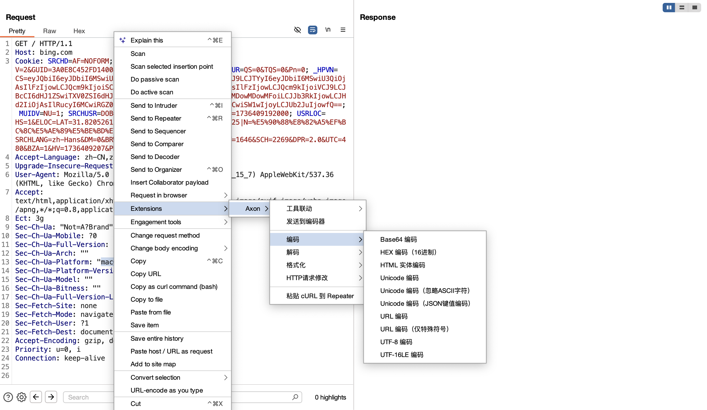
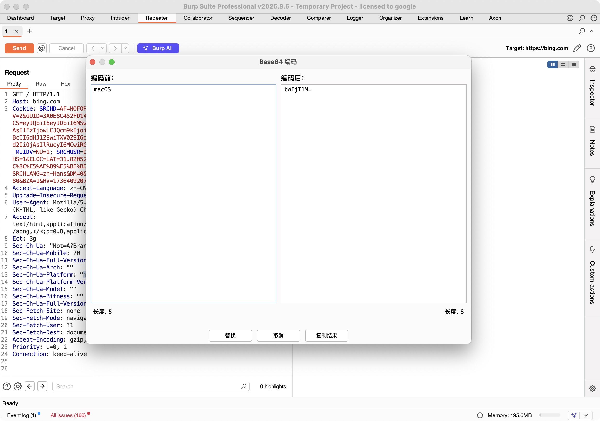

<div align="center">
<h1>Axon</h1>

<p>Burp Suite Operations Toolkit Shortcut Menu Extension</p>

<p>
  <a href="https://mit-license.org/">
    
  </a>
  <a href="https://github.com/opsqw/Axon">
    
  </a>
  <a href="https://github.com/opsqw/Axon">
    
  </a>
  <a href="https://github.com/opsqw/Axon/releases">
    
  </a>
</p>

<div>

English ｜ [简体中文](README_zh-CN.md)

</div>
</div>

---

## 📖 Project Overview

Axon is a powerful Burp Suite extension plugin that provides comprehensive encoding/decoding, HTTP request format conversion, and data processing capabilities, designed to enhance security testing and operational efficiency.

This project is developed based on the Burp Suite Montoya API, serving as a learning exercise and simple implementation of the API. By implementing commonly used encoding conversions, format processing, and other features in the context menu, and extending Burp Suite native features, it provides a deep understanding of the core mechanisms of Burp Suite extension development while offering practical tools for security testers.

## ✨ Key Features

### 🔐 Encoding Functions

- **Base64 Encode** - Standard Base64 encoding
- **HEX Encode** - Hexadecimal encoding
- **Unicode Encode** - Full character Unicode encoding
- **Unicode Encode (Ignore ASCII)** - Encode only non-ASCII characters
- **Unicode Encode (JSON Values)** - Encode JSON keys and values while preserving structure
- **URL Encode** - Complete URL encoding
- **URL Encode (Special Chars)** - Encode only special characters
- **UTF-8 Encode (\x Hex)** - UTF-8 to \x format hexadecimal
- **UTF-16LE Encode (Hex)** - UTF-16 Little-Endian hexadecimal encoding

### 🔓 Decoding Functions

- **Base64 Decode** - Standard Base64 decoding
- **HEX Decode** - Hexadecimal decoding
- **Unicode Decode** - Unicode character decoding
- **URL Decode** - URL decoding

### 📝 Format

- **JSON Compress** - Remove unnecessary whitespace from JSON
- **JSON Format** - Beautify JSON structure
- **XML Compress** - Remove unnecessary whitespace from XML
- **XML Format** - Beautify XML structure

### 🔄 HTTP Request Modification

Direct HTTP request format conversion (no preview window, preserves complete request headers):

> **Note**: The first three functions already exist in Burp Suite's "Change body encoding". The implementation here is for learning and testing purposes only. `Convert to XML POST` is an extended implementation based on this.

- **Convert to Form URL Encoded** - application/x-www-form-urlencoded
- **Convert to JSON POST** - application/json
- **Convert to Multipart** - multipart/form-data
- **Convert to XML POST** - application/xml (Extended feature)

### 🖼️ Independent Main Panel (Axon Tab)

- **Encoder** - Graphical encoding/decoding center with multi-processor switching and real-time parameter adjustment.
- **Tools Integration** - Support for customizing external CLI tool calls (e.g., SQLMap, Nuclei), dynamically injecting request context via template variables.

## 🎯 Distinctive Features

### Smart Preview
- Preview window for encoding/decoding operations
- One-click copy result to clipboard
- Safe replacement with confirmation

### Smart HTTP Request Conversion
- Auto-parse multiple formats (URL-encoded, JSON, Multipart)
- Preserve original request line and headers
- Auto-calculate Content-Length
- Direct application without preview

### Internationalization Support
- Auto-detect language based on system timezone
- Support for Chinese and English interfaces

## 📸 Preview







## 📦 Installation

### Method 1: Build from Source

1. **Clone the repository**
```bash
git clone https://github.com/opsqw/Axon.git
cd Axon
```

2. **Build the plugin**
```bash
./gradlew clean build
```

3. **Load the plugin**
- Open Burp Suite
- Go to `Extensions` → `Add`
- Select `build/libs/Axon-1.0.4.jar`
- Click `Next` to complete installation

### Method 2: Direct Download

Download the latest JAR file from the [Releases](https://github.com/opsqw/Axon/releases) page, then load it in Burp Suite.

## 🚀 Usage

### Encoding/Decoding Operations

1. In any Burp Suite HTTP message editor (Repeater, Proxy History, etc.)
2. Select the text to process
3. Right-click → `Axon`
4. Choose the desired encoding or decoding function
5. Review the result in the preview window
6. Click "Replace" to apply changes, or "Copy Result" to copy to clipboard

### HTTP Request Format Conversion

1. In the HTTP request editor (no text selection needed)
2. Right-click → `Axon` → `HTTP Modify`
3. Select target format (e.g., "Convert to JSON POST")
4. Request will be instantly converted (direct application, no preview)

### Format Operations

1. Select the content to format (complete JSON or XML) in the HTTP message editor
2. Right-click → `Axon` → `HTTP Modify` → `Format`
3. Choose the corresponding function:
   - **JSON Format** - Beautify JSON with indentation and line breaks
   - **JSON Compress** - Remove unnecessary whitespace and line breaks from JSON
   - **XML Format** - Beautify XML structure
   - **XML Compress** - Remove unnecessary whitespace from XML
4. Review the result in the preview window and click "Replace" to apply changes

### JSON Values Unicode Encoding

Encode JSON keys and values to Unicode while preserving JSON structure. The encoded JSON remains parsable.

1. Select complete JSON text
2. Right-click → `Axon` → `Encode` → `Unicode Encode (JSON Values)`
3. JSON keys and values will be encoded while structure remains unchanged

## 💡 Usage Scenarios

### Scenario 1: UTF-8 Encoding - Chinese Search in Burp Proxy & Response Matching in Intruder

UTF-8 encoding can be used for Chinese keyword search in Burp Suite's Proxy module and response matching in Intruder module.

**Example: Search for Chinese keyword "成功" (success)**
```
Original text: 成功
UTF-8 encoded: \xe6\x88\x90\xe5\x8a\x9f
```

Use the encoded hexadecimal value in Burp Suite Proxy's search box or Intruder's Grep-Match to match Chinese content.

**For detailed usage, please refer to**: [Burp Suite Tips](https://opsqw.github.io/tips-burpsuite)

### Scenario 2: Unicode Encoding (JSON Values) - Bypass WAF JSON Filtering

Encode JSON keys and values to Unicode while maintaining JSON structure integrity, useful for bypassing certain WAF's JSON keyword detection.

**Example:**
```json
// Before encoding
{"name": "John", "city": "Beijing"}

// After encoding (all characters encoded)
{"\u006e\u0061\u006d\u0065": "\u004a\u006f\u0068\u006e", "\u0063\u0069\u0074\u0079": "\u5317\u4eac"}
```

The encoded JSON can still be parsed normally by the server, but some WAFs may fail to recognize the encoded malicious payload.

### Scenario 3: UTF-16LE Encoding - CVE-2025-66487 React2Shell RCE Bypass WAF

Use UTF-16LE encoding to bypass WAF detection of malicious payloads in React Server Components.

**CVE-2025-66487 Vulnerability Exploitation Example:**
```
Original Payload:
{"type":"$","key":null,"ref":null,"props":{"is":"script","children":"alert(1)"}}

UTF-16LE Hexadecimal Encoding:
7b0022007400790070006500220... (complete hexadecimal string after encoding)
```

**Usage Steps:**
1. Select the malicious payload text
2. Right-click → `Axon` → `Encode` → `UTF-16LE Encode (Hex)`
3. Send the encoded result as request body
4. **Important: Manually set request header** `Content-Type: text/plain; charset=utf-16le`

Through UTF-16LE encoding, the WAF may fail to parse the payload correctly, while the target application server can process it normally, thus achieving WAF bypass.

## 🛠️ Technology Stack

- **Language**: Java
- **Build Tool**: Gradle 8.11.1
- **Dependencies**:
  - Burp Suite Montoya API 2023.12.1
  - Gson 2.10.1
  - JUnit 5.10.0

## 📂 Project Structure

```
Axon/
├── src/main/java/org/example/
│   ├── config/                          # Configuration management
│   │   └── ConfigManager.java
│   ├── i18n/
│   │   └── I18n.java                    # Internationalization support
│   ├── model/                           # Data models
│   │   └── ToolConfig.java
│   ├── ui/                              # UI components
│   │   ├── encoder/                     # Encoder panel and processors
│   │   ├── AxonTab.java                 # Main Tab panel
│   │   └── ToolsIntegrationPanel.java   # Tool integration panel
│   ├── utils/                           # Utility classes
│   │   ├── CommandExecutor.java         # Command execution
│   │   ├── DecoderUtils.java            # Decoding utilities
│   │   ├── EncoderUtils.java            # Encoding utilities
│   │   └── ...
│   ├── AxonContextMenuProvider.java     # Context menu provider
│   ├── AxonExtension.java               # Main plugin class
│   └── PreviewDialog.java               # Preview dialog
├── build.gradle                         # Gradle configuration
└── README.md                            # This document
```

## 🤝 Contributing

Issues and Pull Requests are welcome!

## 📄 License

This project is licensed under the [MIT License](./LICENSE).

## 🙏 Acknowledgments

- Burp Suite team for the excellent Montoya API
- Gson library for JSON processing support
- Yakit: Reference for the right-click menu
- mingdong: Reference for tool integration

## 💖 Support the Project

❤️ If you like this project, give it a ⭐ and share it with friends!

---

<div align="center">

Made with ❤️ by [opsqw](https://github.com/opsqw)

</div>
